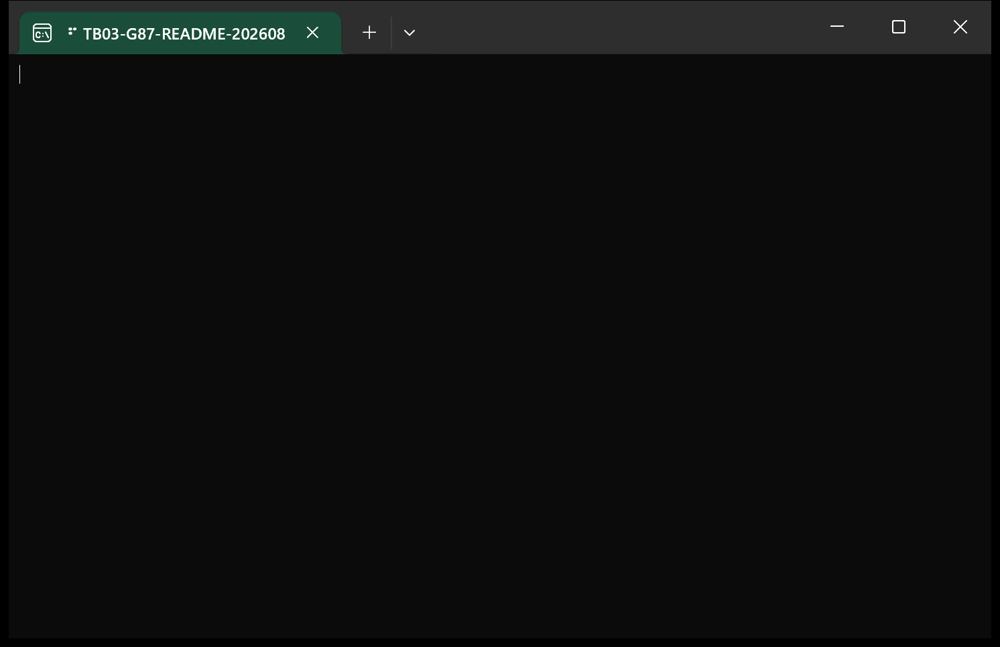
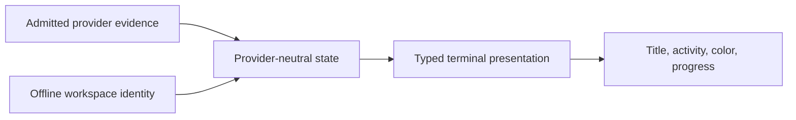

<p align="center">
  
</p>

<p align="center"><strong>Live identity and status for coding-agent tabs, without changing how you launch them.</strong></p>

<p align="center">English | <a href="README.zh-CN.md">简体中文</a></p>

<!-- tabbeacon:hero-badges:start -->
<p align="center">
  <a href="https://www.rust-lang.org/"></a>
  <a href="https://github.com/JerrySkywalker/tabbeacon/actions/workflows/ci.yml"></a>
</p>
<!-- tabbeacon:hero-badges:end -->

<p align="center"><a href="https://github.com/JerrySkywalker/tabbeacon/releases">Releases</a> · <a href="https://crates.io/crates/tabbeacon">crates.io</a> · <a href="docs/README.md">Documentation</a> · <a href="LICENSE">MIT License</a></p>

<!-- tabbeacon:critical-invariants install=cargo-install-tabbeacon-locked setup=tabbeacon-setup codex=codex agy=agy providers=codex-agy claude=deferred opencode=deferred trust=manual fail-open=true privacy=content-minimal -->

## Why TabBeacon?

Coding-agent tabs are easy to lose in a busy Windows Terminal. TabBeacon gives
each supported session a stable workspace identity and a compact, evidence-driven
status signal while preserving the commands you already use. Daily launch stays
literally `codex` or `agy`; TabBeacon is not a wrapper, PTY host, terminal
replacement, or background daemon.

## What It Looks Like

The production visual backend is title-first and intentionally compact:

```text
○ OWH     idle identity
⠋ OWH     working
✓ OWH     result ready
! OWH     attention
? OWH     question
```



> [!NOTE]
> Real Windows Terminal rendering using TabBeacon's deterministic presentation
> fixture. It is not a live Codex or Agy model conversation.

## Features

- Stable, offline-first workspace aliases with Git identity as a specialization.
- Typed title, activity, tab-color, and Windows Terminal-progress presentation.
- Evidence-driven status with fail-open behavior when an integration is absent
  or cannot prove a claim.
- Guided setup, presets, a keyboard-only Control Center, and portable
  preferences that stay user-global rather than repository-local.
- Read-only diagnostics for title, workspace, compatibility, hooks, and
  session projections without persisting prompt, assistant, or tool content.
- Ownership-safe configuration changes that preserve unrelated provider settings.

## Supported Coding Agents

| Coding Agent | Status | Daily command | Compatibility policy |
| --- | --- | --- | --- |
| Codex CLI | Production | `codex` | Capability-based; a version string is diagnostic only. |
| Agy CLI | Production | `agy` | Exact admitted profile: Agy 1.1.19. |

### Deferred integrations

- Claude Code — Deferred
- OpenCode — Deferred

They are not partially supported and are not enabled by this release train.

## Quick Start

Current public release: **v0.6.1**. v0.7 documentation is in development and
is not a published release.

Install the public CLI, then run the guided setup:

```powershell
cargo install tabbeacon --locked
tabbeacon setup
```

Review provider Hook trust manually when the supported setup flow asks for it.
Then launch your coding agent as usual:

```powershell
codex
```

For the admitted Agy profile, configure its user-global title callback and keep
the daily command literal:

```powershell
tabbeacon setup agy
agy
```

> [!TIP]
> `tabbeacon setup --quick` visits only missing, stale, or action-required setup
> work. Review any proposed change before applying it; it does not turn
> TabBeacon into a launcher.

## Compatibility

TabBeacon targets Windows Terminal on Windows. Codex support is derived from
locally observed required capabilities, not from a version ordering rule. Agy
support is intentionally narrower: only the exact admitted 1.1.19 profile is
production-supported. Unavailable or unproven evidence fails open instead of
being guessed into a compatible state.

## How It Works



Provider identity, runtime state, and workspace identity are separate slots.
Presentation makes their relationship visible; it never grants trust,
compatibility, configuration ownership, or process control.

## Safety & Privacy

TabBeacon is fail-open for coding agents and fail-closed for configuration
ownership. Hook trust stays manual. Normal presentation does not ingest or
persist prompt content, assistant content, or tool content. Read-only status
surfaces expose bounded operational facts rather than credentials, raw session
identifiers, or environment dumps.

Native Windows Terminal tab icons are **NO_GO** under the accepted current-host
feasibility evidence. Stock Windows Terminal has no supported public tab-icon
bridge, and the only remaining instrumentation route could not be isolated
safely. `TitleMarkBackend` remains the production visual path.

## Configuration

Use the guided flow for cohesive setup, or inspect and change closed typed
preferences directly:

```powershell
tabbeacon config show
tabbeacon config wizard
tabbeacon config set spinner braille
tabbeacon config set theme muted-dark
tabbeacon config preset balanced
tabbeacon ui
```

Preferences are distinct from provider integration state, Hook trust, and
runtime/session evidence. See the [Codex Hooks guide](docs/codex-hooks.md) and
[Agy setup guide](docs/agy-setup.md) for current ownership boundaries.

## Documentation

- [Documentation portal](docs/README.md)
- [Technical overview](docs/architecture.md)
- [Architecture](docs/architecture.md)
- [Codex Hooks](docs/codex-hooks.md)
- [Agy setup](docs/agy-setup.md)
- [Codex compatibility](docs/CODEX_COMPATIBILITY_V3.md)
- [Terminal visual backends](docs/TERMINAL_VISUAL_BACKENDS.md)
- [Native tab-icon disposition](docs/research/WT_NATIVE_ICON_DISPOSITION.md)

## Contributing

Contributions are welcome. Start with [CONTRIBUTING.md](CONTRIBUTING.md); use a
focused branch and let exact-head CI validate the candidate. High-risk changes
to provider configuration, process targeting, or terminal instrumentation have
additional governance and safety boundaries.

## License

TabBeacon is licensed under the [MIT License](LICENSE).
