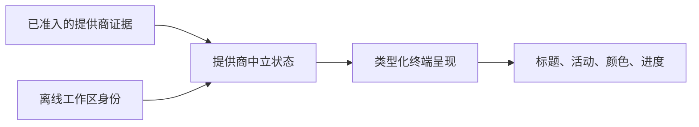

<p align="center">
  
</p>

<p align="center"><strong>为编码智能体标签页提供实时身份与状态，同时不改变你的启动方式。</strong></p>

<p align="center">简体中文 | <a href="README.md">English</a></p>

<!-- tabbeacon:hero-badges:start -->
<p align="center">
  <a href="https://www.rust-lang.org/"></a>
  <a href="https://github.com/JerrySkywalker/tabbeacon/actions/workflows/ci.yml"></a>
</p>
<!-- tabbeacon:hero-badges:end -->

<p align="center"><a href="https://github.com/JerrySkywalker/tabbeacon/releases">发布版本</a> · <a href="https://crates.io/crates/tabbeacon">crates.io</a> · <a href="docs/README.md">文档</a> · <a href="LICENSE">MIT 许可证</a></p>

<!-- tabbeacon:critical-invariants install=cargo-install-tabbeacon-locked setup=tabbeacon-setup codex=codex agy=agy providers=codex-agy claude=deferred opencode=deferred trust=manual fail-open=true privacy=content-minimal -->

## 为什么选择 TabBeacon？

在繁忙的 Windows Terminal 中，编码智能体标签页很容易混在一起。TabBeacon
为已支持的会话提供稳定的工作区身份和紧凑、由证据驱动的状态提示，同时保留你
已经在使用的命令。日常启动仍然是字面量 `codex` 或 `agy`；TabBeacon 不是包装器、
PTY 主机、终端替代品或后台守护进程。

## 它是什么样子？

生产视觉后端以标题为先，并且刻意保持紧凑：

```text
○ OWH     空闲身份
⠋ OWH     正在工作
✓ OWH     结果就绪
! OWH     需要注意
? OWH     问题
```


> [!NOTE]
> 由 TabBeacon 确定性展示夹具驱动的真实 Windows Terminal 渲染效果；这不是实时
> Codex 或 Agy 模型对话。

## 功能

- 离线优先的稳定工作区别名，并将 Git 身份作为一种专门化形式。
- 类型化的标题、活动状态、标签颜色和 Windows Terminal 进度呈现。
- 证据驱动的状态；当集成缺失或无法证明某项声明时保持 fail-open。
- 引导式设置、预设、键盘操作的 Control Center，以及保留在用户全局范围内而非
  仓库本地的可移植偏好设置。
- 标题、工作区、兼容性、Hook 和会话投影的只读诊断；不会持久化 prompt、助手或
  工具内容。
- 保留无关提供商设置的、所有权安全的配置变更。

## 支持的编码智能体

| 编码智能体 | 状态 | 日常命令 | 兼容性策略 |
| --- | --- | --- | --- |
| Codex CLI | 生产支持 | `codex` | 基于能力；版本字符串仅用于诊断。 |
| Agy CLI | 生产支持 | `agy` | 精确准入配置：Agy 1.1.19。 |

### 延后集成

- Claude Code — Deferred
- OpenCode — Deferred

它们不是部分支持，也不会在此发布列车中启用。

## 快速开始

当前公开版本：**v0.7.0**。

安装公开 CLI，然后运行引导式设置：

```powershell
cargo install tabbeacon --locked
tabbeacon setup
```

当受支持的设置流程要求时，请手动审查提供商 Hook 信任。随后按原样启动编码智能体：

```powershell
codex
```

对于已准入的 Agy 配置，请配置其用户全局标题回调，并保持日常命令不变：

```powershell
tabbeacon setup agy
agy
```

> [!TIP]
> `tabbeacon setup --quick` 只处理缺失、过期或需要操作的设置工作。应用前请审查
> 所有建议的变更；它不会把 TabBeacon 变成启动器。

## 兼容性

TabBeacon 面向 Windows 上的 Windows Terminal。Codex 支持由本地观察到的必需能力
确定，而不是由版本排序规则确定。Agy 支持刻意更窄：只有精确准入的 1.1.19 配置
被生产支持。不可用或未证明的证据会 fail-open，而不会被猜测为兼容状态。

## 工作方式



提供商身份、运行时状态和工作区身份是三个独立槽位。呈现使它们之间的关系可见；
它从不授予信任、兼容性、配置所有权或进程控制权。

## 安全与隐私

TabBeacon 对编码智能体 fail-open，对配置所有权 fail-closed。Hook 信任保持手动。
正常呈现不会采集或持久化 prompt 内容、助手内容或工具内容。只读状态表面只公开
受限的运行事实，而不会公开凭据、原始会话标识符或环境转储。

在已接受的当前主机可行性证据下，Windows Terminal 原生标签图标为 **NO_GO**。
库存 Windows Terminal 没有受支持的公开标签图标桥接；仅剩的仪器化路径无法安全
隔离。`TitleMarkBackend` 仍是生产视觉路径。

## 配置

建议使用引导流程进行完整设置；也可以直接查看和修改封闭的类型化偏好：

```powershell
tabbeacon config show
tabbeacon config wizard
tabbeacon config set spinner braille
tabbeacon config set theme muted-dark
tabbeacon config preset balanced
tabbeacon ui
```

偏好设置与提供商集成状态、Hook 信任和运行时/会话证据彼此独立。当前所有权边界请
参阅 [Codex Hooks 指南](docs/codex-hooks.md) 和 [Agy 设置指南](docs/agy-setup.md)。

## 文档

- [文档入口](docs/README.md)
- [技术概览](docs/architecture.md)
- [架构](docs/architecture.md)
- [Codex Hooks](docs/codex-hooks.md)
- [Agy 设置](docs/agy-setup.md)
- [Codex 兼容性](docs/CODEX_COMPATIBILITY_V3.md)
- [终端视觉后端](docs/TERMINAL_VISUAL_BACKENDS.md)
- [原生标签图标结论](docs/research/WT_NATIVE_ICON_DISPOSITION.md)

## 贡献

欢迎贡献。请从 [CONTRIBUTING.md](CONTRIBUTING.md) 开始，使用聚焦分支，并让精确
HEAD CI 验证候选提交。提供商配置、进程定位或终端仪器化等高风险变更还有额外的
治理和安全边界。

## 许可证

TabBeacon 采用 [MIT 许可证](LICENSE)。
